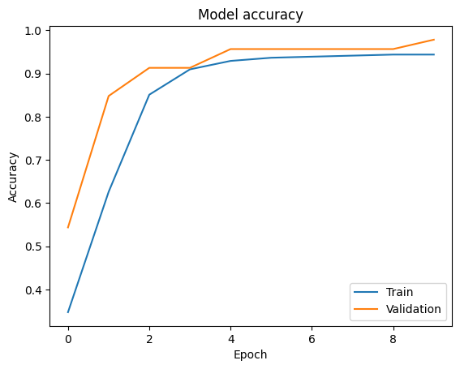

# Can-Cure

Can-Cure is a small Streamlit application providing a frontend for a predictive ML model. The app accepts a single-sample form or a CSV upload (first 30 columns used) and returns prediction results along with visual output.

**Accuracy Scores**



**Key Features:**
- **Simple UI**: Streamlit form and CSV upload for single or batch predictions.
- **Preprocessing**: Uses provided scaler and trained model artifacts for consistent inputs.
- **Quick Deploy**: Run locally with Streamlit for fast experimentation.

**Quick Start**

1. Create a virtual environment and install dependencies:

```bash
python -m venv .venv
# On macOS / Linux
source .venv/bin/activate
# On Windows PowerShell
.venv\Scripts\Activate.ps1
# Or on Windows CMD
.venv\Scripts\activate.bat
pip install -r requirements_app.txt
```

2. Run the Streamlit app:

```bash
streamlit run app.py
```

3. In the browser UI either fill the single-sample form or upload a CSV file. The app will display predictions and example visual output saved as `output.png`.

**Repository Files**
- `app.py`: Main Streamlit application.
- `model.ipynb`: Notebook used for training / exploration.
- `requirements_app.txt`: Python dependencies for the app.
- `output.png`: Example output visualization generated by the app.

**Notes**
- Place model artifacts (e.g., `model.pkl`, `scaler.pkl`) in the project root if the app expects them.
- The CSV upload uses the first 30 columns; modify the code if your dataset differs.

**Developped By Surya Dutta**

